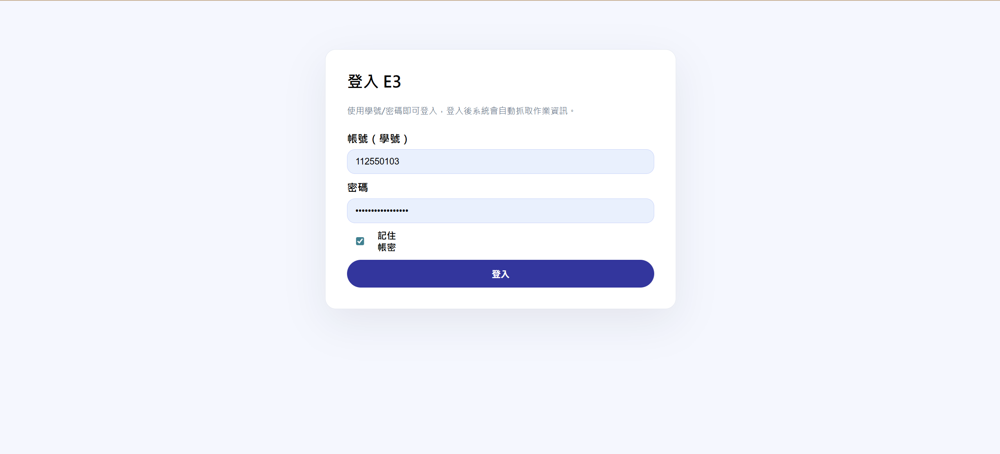
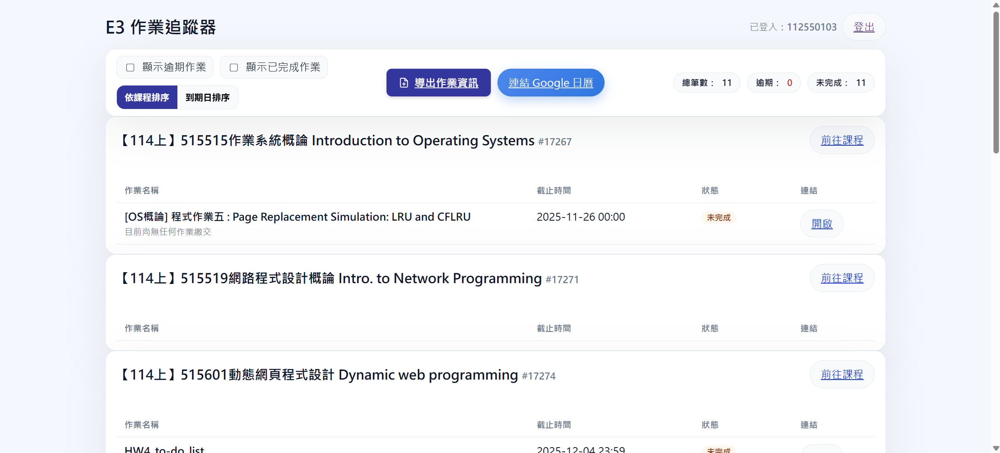
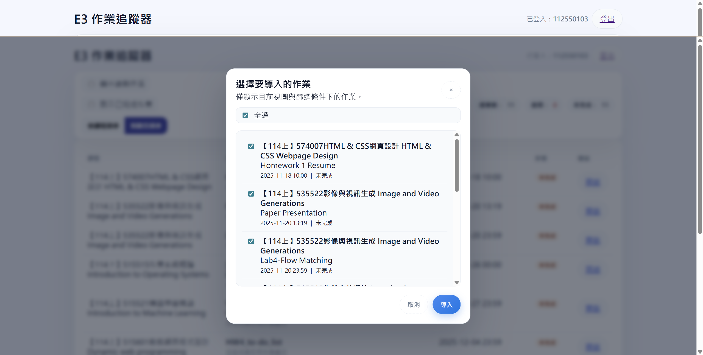
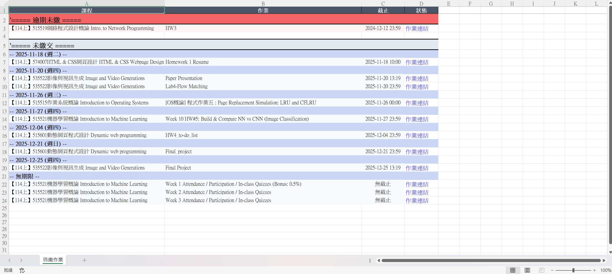

# E3 作業追蹤器（Web）

👉 https://e3hwtool.space

幫助 NYCU 學生統整 E3 平台上的所有作業。只要登入自己的E3帳號，系統就會列出所有課程作業、狀態、截止日期，還能導出 Excel 或同步到 Google 日曆。

---

## 功能一覽

| 功能                           | 說明                                                                                  |
| ------------------------------ | ------------------------------------------------------------------------------------- |
| 作業蒐集                       | 會將所有課程作業抓成列表，並顯示逾期 / 已完成標記。                                        |
| 視圖切換                       | Web 介面提供「依課程」與「依截止日」兩種視圖，可用複選框篩選條件。                          |
| Excel 導出                     | 一鍵輸出待繳作業，可供自行整理或分享。                                                    |
| Google 日曆同步                | 以桃紅色事件、兩天前提醒的方式加入 Google Calendar，且可在彈窗中勾選要同步的作業。           |
| 作業連結按鈕                    | 點擊每份作業旁的按鈕即可跳轉至該作業的繳交畫面，方便直接完成及查看作業說明                   |
| 支援手機瀏覽                   |  使用者也可以用手機來使用網站，各式功能同樣支援，且會根據設備大小調整排版                     |

---

## 操作流程

1. **登入網站**  
   - 進入 https://e3hwtool.space  
   - 初次登入需輸入 E3 帳密，且須稍等大約10~15秒來抓取作業資訊。

2. **檢視作業**  
   - 預設顯示依課程排序，可改為「到期日排序」。  
   - 勾選「顯示逾期作業」、「顯示已完成作業」便可即時篩選。  
   - 每筆作業都會列出狀態與直接連結。

3. **導出 Excel**  
   - 工具列按下「導出作業資訊」，會下載 `待繳作業.xlsx`。  
   - Excel 內容會依目前篩選條件整理，方便另存或分享。

4. **導入 Google 日曆**  
   - 第一次需要先點「連結 Google 日曆」。  
   - 完成 OAuth 授權後，就會有「導入至 Google 日曆」的按鈕。 
   - 點擊後跳出彈窗，彈窗會列出「在目前篩選條件下」所有有截止日的作業，可任意勾選後按「導入」。  
   - 輸出後的內容在日曆內會顯示為桃紅色（Google Calendar colorId 4）、並設定兩天前提醒(之後應該會改成可更改)。

---

## 介面截圖

1. **登入頁**  
   

2. **作業總覽（課程視圖）**  
   
   

3. **Google 日曆導入彈窗**  
   

4. **輸出待繳清單**  
   
   
---

## 安全與隱私建議

- **HTTPS**：整站使用 AWS ACM 憑證，請務必透過 `https://e3hwtool.space` 連線。
- **OAuth 限制**：NYCU OAuth 只能取得基本身分，無法自動產生 MoodleSession，因此仍需使用用戶直接輸入帳密來登入。未來若學校提供正式 API，再改為純 OAuth。

---

## 常見問題

| 問題                                             | 解法                                                                                                  |
| ------------------------------------------------ | ----------------------------------------------------------------------------------------------------- |
| 瀏覽器顯示「連線不安全」                           | 請確認使用的是 `https://e3hwtool.space`。                                                              |

---

## 聯絡 / 貢獻

- 若有建議或功能需求，歡迎開 Issue 。
- 任何與隱私、安全相關的疑慮，也可透過 GitHub Issue 私訊討論。

---

## 網站連結

👉 **https://www.e3hwtool.space**
